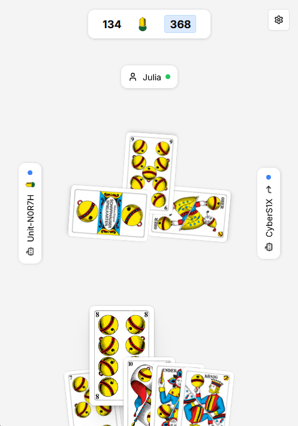

# Yass

A modern, browser-based implementation of Jass — the classic Swiss card game.

**Play the game:** [yass.gg](https://yass.gg)

## About

Yass brings the beloved Swiss national card game to the modern web. No installation needed, no ads, and completely free to play. Play against bots or with friends, all directly in your browser.

## Features

- Login as guest or with email and password
- Create a game and play either to a point total or number of hands
- Play against bots or with a partner
- Join a game via QR code or game code
- Real-time presence indicators for all players
- Full game mechanics: declare weise, schiebe, trump, Stoeck
- Display current score
- Detailed analysis view after each game
- Choose language and playing card style

## Technology Stack

### Backend
- **Language**: Kotlin
- **Framework**: Javalin
- **Database**: PostgreSQL with jOOQ for type-safe queries
- **Real-time**: Centrifugo WebSockets
- **Authentication**: Ory

### Frontend - Main Client
- **Framework**: React with TypeScript
- **Styling**: Tailwind CSS
- **Components**: shadcn/ui
- **State Management**: Zustand
- **i18n**: react-i18next
- **Real-time**: Centrifuge client

## Game Screenshots / Demo

For a video demo, see: [Demo](client/public/assets/demo.mp4)

## Contributing

So far contributions are not open to the public. I will update this as soon as I figured out on how I can handle this best.

## License

This project is licensed under the [Creative Commons Attribution-NonCommercial 4.0 International](https://creativecommons.org/licenses/by-nc/4.0/) (CC BY-NC 4.0).

You are free to use, modify, and distribute this work as long as:
- You provide appropriate attribution
- Your use is non-commercial